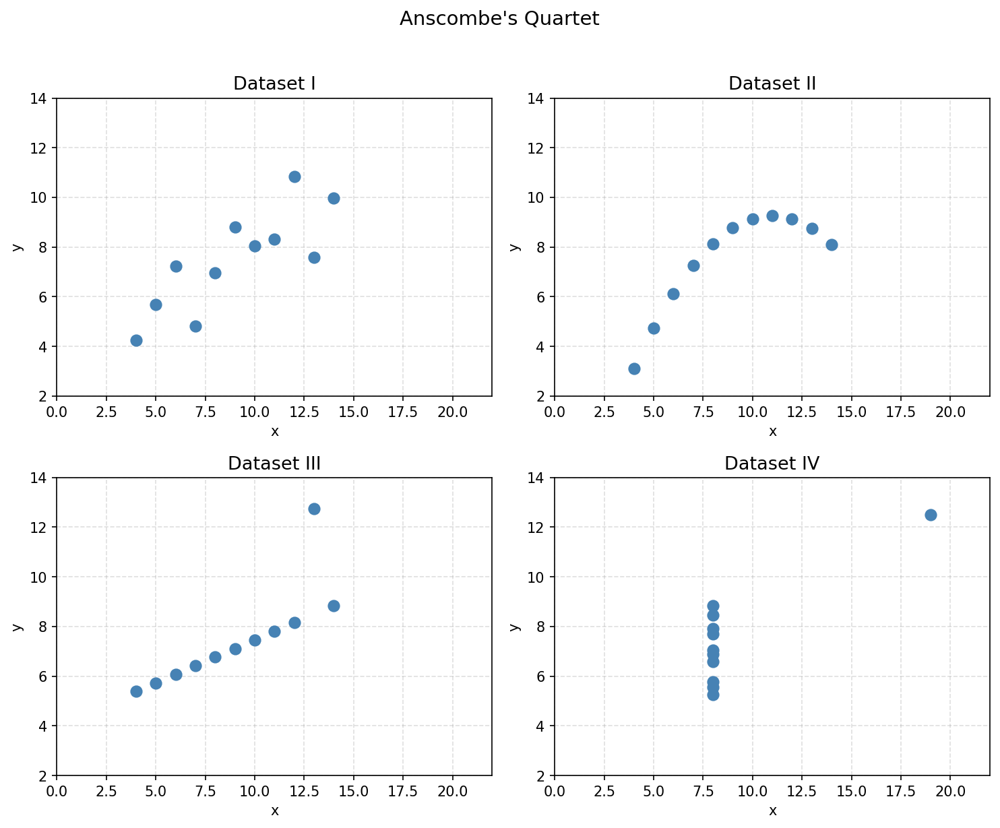
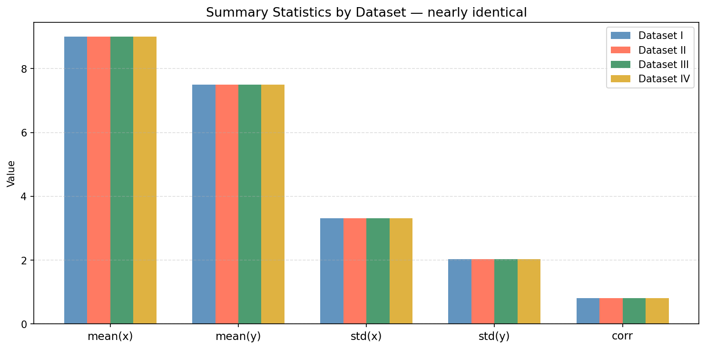
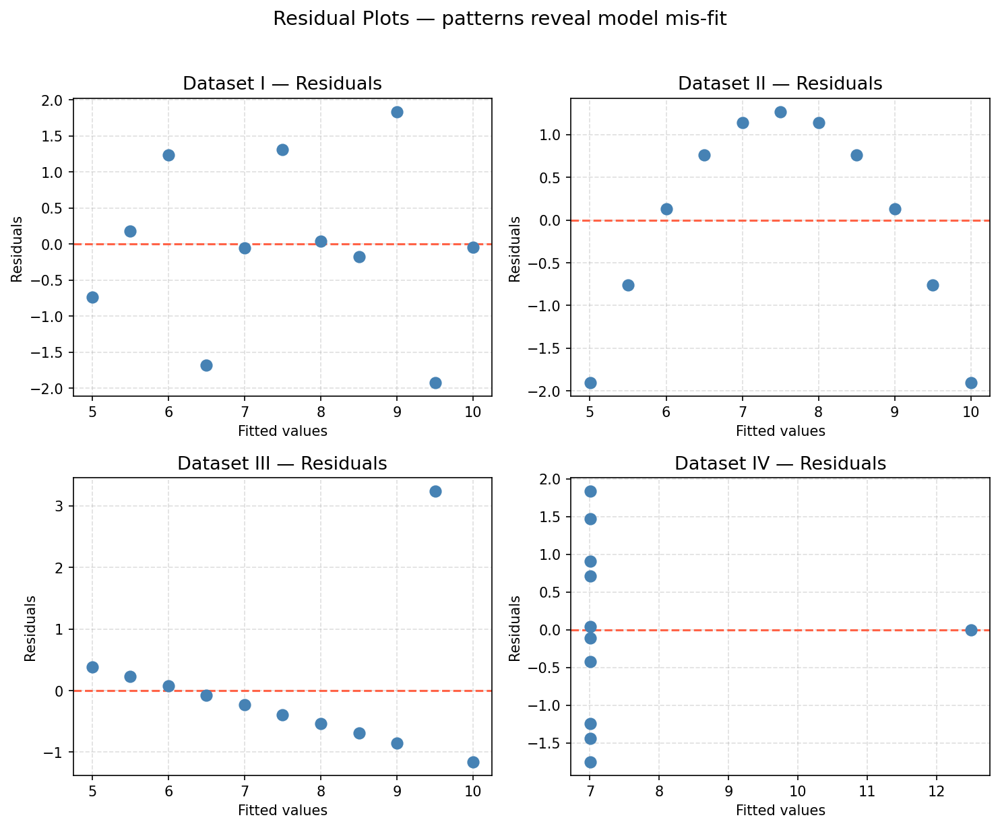

# Data Analysis — Lecture 12: Anscombe's Quartet

An exploration of **Anscombe's Quartet**, a classic dataset that demonstrates why visualizing data matters. All four datasets share nearly identical summary statistics yet reveal fundamentally different structures when plotted.

---

## Background

Anscombe's Quartet was constructed in 1973 by statistician Francis Anscombe to illustrate the importance of graphing data before analyzing it, and the effect that outliers and other influential observations can have on statistical properties.

The quartet consists of four datasets (I, II, III, IV), each with 11 (x, y) data points that share the same:

| Statistic        | Value      |
|------------------|------------|
| mean(x)          | 9.0        |
| mean(y)          | ≈ 7.50     |
| std(x)           | ≈ 3.32     |
| std(y)           | ≈ 2.03     |
| correlation(x,y) | ≈ 0.816    |
| regression line  | y ≈ 3 + 0.5x |

Yet each dataset tells a completely different story:

| Dataset | Structure |
|---------|-----------|
| I | Linear relationship with random scatter — the textbook case |
| II | Clean nonlinear (quadratic) curve — a linear model is wrong |
| III | Mostly linear, but one outlier distorts the regression |
| IV | All x = 8 except one leverage point (x = 19) that drives the slope |

---

## Repository Contents

```
.
├── Anscombe/
│   ├── anscombe_quartet.tsv      # Source data (4 datasets, 11 points each)
│   ├── anscombe_analysis.ipynb   # Executed Jupyter notebook with analysis and plots
│   ├── plot1_scatter.png         # 2×2 scatter plot grid
│   ├── plot2_stats_bars.png      # Summary statistics bar chart
│   ├── plot3_residuals.png       # Residual plots (2×2 grid)
│   └── File Plan                 # Original project plan and proposal
└── README.md
```

---

## Notebook Overview

`anscombe_analysis.ipynb` walks through the full analysis in six sections:

1. **Load Data** — reads `anscombe_quartet.tsv` into a pandas DataFrame
2. **Descriptive Statistics** — computes mean, std, correlation, and regression coefficients per dataset, confirming their near-identical values
3. **Plot 1 — Scatter Plots** — 2×2 grid of scatter plots, one per dataset, with shared axis scales
4. **Plot 2 — Summary Statistics Bar Chart** — side-by-side comparison of key statistics across datasets
5. **Plot 3 — Residual Plots** — residuals vs. fitted values, revealing curvature, outliers, and leverage points
6. **Conclusion** — written summary of what each dataset illustrates

---

## Plots

### Plot 1 — Scatter Plots


### Plot 2 — Summary Statistics


### Plot 3 — Residual Plots


---

## Requirements

- Python 3.10+
- `pandas`
- `numpy`
- `matplotlib`
- `scipy`

Install dependencies:

```bash
pip install pandas numpy matplotlib scipy
```

Run the notebook:

```bash
jupyter notebook anscombe_analysis.ipynb
```

---

## Key Takeaway

> Summary statistics alone are insufficient. Always visualize your data.
